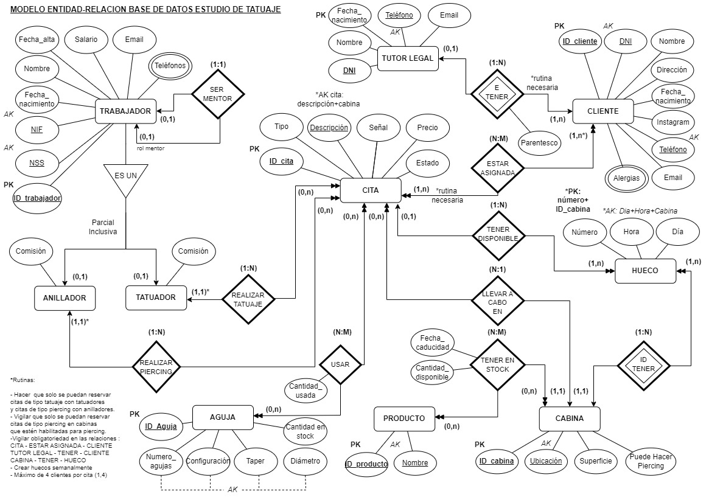

# BBDD-estudio-tattoo
Creación de una base de datos para un estudio de tatuaje.

**Índice**
- [**Requisitos**](#requisitos)
- [**Diagrama**](#diagrama-entidad-relación)
- [**Diccionario de datos**](#diccionario-de-datos)
  - [**Tutores Legales**](#1tabla-tutores-legales)
  - [**Clientes**](#2tabla-clientes)
  - [**Alergias_clientes**](#3tabla-alergias_clientes)
  - [**Cabinas**](#4tabla-cabinas)
  - [**Huecos**](#5tabla-huecos)
  - [**Productos**](#6tabla-productos)
  - [**Agujas**](#7tabla-agujas)
  - [**Trabajadores**](#8tabla-trabajadores)
  - [**Anilladores**](#9tabla-anilladores)
  - [**Tatuadores**](#10tabla-tatuadores)
  - [**Teléfonos_trabajadores**](#11tabla-teléfonos_trabajadores)
  - [**Citas**](#12tabla-citas)
  - [**Citas_clientes**](#13tabla-citas_clientes)
  - [**Citas_agujas**](#14tabla-citas_agujas)
  - [**Productos_cabinas**](#15tabla-productos_cabinas)
- [**Autores**](#autores)

# Requisitos
Deseamos diseñar una BBDD que guarde la información necesaria para la gestión
de un estudio de tatuajes. Los supuestos considerados son los siguientes:

1) Una **cita** está definida por una breve descripción, la fecha y hora en que se realiza, estado de la cita (reservada o pendiente, realizada…) y duración aproximada de esta, el precio, la cantidad depositada como señaly el precio total. También registramos el tipo de cita (de tatuaje o de piercing).

2) De cada **trabajador** del estudio vamos a registrar su nombre, nif, número de la seguridad social, fecha de alta en el estudio, fecha de nacimiento, dirección completa, email y uno o más teléfonos. Registramos el salario como opcional, porque hay trabajadores que cobran según su porcentaje.

3) De cada **cliente** recogeremos su nombre completo, DNI, dirección completa, fecha de nacimiento, instagram (opcional), email (opcional), un teléfono de contacto y posibles alergias.

4) El estudio consta de varias cabinas donde se llevan a cabo las citas. De cada **cabina** vamos a registrar un número de identificación, su ubicación en el estudio y su superficie. Además, algunas cabinas están habilitadas para hacer piercing.

5) Cada cabina dispone de varios productos de los que necesitamos llevar un inventario. Para cada **producto** almacenamos su nombre, su identificador y su fecha de caducidad.

6) Una cabina consta de varios huecos para gestionar la disponibilidad de las citas. Cada **hueco** cuenta con un número y se identificará con ese número más el identificador de su cabina. Además se guardará de cada uno la hora, el día y si está o no disponible para una fecha y una hora.

7) En la realización de un tatuaje es necesario el uso de agujas. Para cada **aguja** vamos a guardar su identificador, el numero de agujas de las que dispone, la configuración de estas, la longitud del taper y la cantidad de agujas disponibles en el estudio. El tipo de aguja se define por: numero de agujas + configuración + taper. No puede haber dos agujas registradas del mismo tipo.

8) Algunos trabajadores pueden ser **tatuadores** y algunos pueden ser **anilladores**. Un tatuador puede ser anillador y viceversa. Los tatuadores y los anilladores no tienen un salario fijo, sino que se registra el porcentaje pactado con el estudio que se llevan por cada cita.

9) Es posible que algunos clientes sean menores de edad, así que necesitamos recoger los datos de un **tutor legal** del que guardaremos su DNI, nombre, fecha de nacimiento, un teléfono de contacto y su email.

10) Una cita de tatuaje tiene que ser realizada por un tatuador y un tatuador podrá realizar varias citas. Una cita de piercing tiene que ser realizada por un anillador y un anillador podrá realizar varias citas.  Al mismo tiempo, una cita se tiene que llevar a cabo en una única cabina. En una cabina se pueden llevar a cabo varias citas en un día. Una cita tiene que estar asignada a uno o varios clientes y cada cliente podrá reservar o tener realizadas varias citas. En cada cita puede que se utilicen uno o más tipos de agujas y un tipo concreto de aguja puede ser utilizado en varias citas diferentes.

11) En cada cabina puede haber uno o más productos. Un tipo de producto puede estar en varias cabinas. Cuando una cabina contenga un producto necesitamos saber que cantidad de ese producto se guarda en la cabina. 

12) Una cabina tiene uno o más huecos. Un hueco tiene que pertenecer a una cabina y solo a una. 

13) Las citas de tipo piercing solo pueden ser llevadas a cabo en una cabina habilitada para hacer piercing.

14) Algunos trabajadores pueden ser mentores de otro trabajador. Un mentor lo será de un único trabajador, y un trabajador podrá tener como máximo un mentor asignado.

15)  Un cliente podrá tener un tutor legal como máximo en caso de ser menor de edad, y a su vez un tutor legal podrá serlo de varios clientes. Vamos a registrar también el parentesco entre el tutor legal y el cliente.

# Diagrama entidad-relación

# Diccionario de datos

Resumen :
- tablas: ` 15 (10 entidades, 2 multivaluados, 3 relaciones N:M)`
- claves foráneas: `16 (6 relaciones + 6 N:M + 2 especializaciones + 2 multivaluados)`

### 1.Tabla: Tutores Legales

-----------------------------------
Columnas: `4`

| Identificador de columna | Tipo de dato/ Rango | R. Obligatoriedad | R. Unicidad | Índice |
|--------------------------|----------------------|-------------------|-------------|--------|
| DNI                      | Char(9)              | Sí                | Sí          | Primary Key |
| Nombre                   | Varchar(50)          | Sí                | No          | - |
| Fecha_nacimiento         | Date                 | Sí                | No          | - |
| Teléfono                 | Varchar(15)          | Sí                | Sí          | Alternative Key |

Índices:

| Identificador de índice | Tipo de índice |
|-------------------------|----------------|
| DNI                     | Primary        |
| AK_Telefono             | Alternative    |

### 2.Tabla: Clientes

-----------------------------------
Columnas: `10  (8 + 2) `

| Identificador de columna | Tipo de dato/ Rango | R. Obligatoriedad | R. Unicidad | Índice |
|--------------------------|----------------------|-------------------|-------------|--------|
| ID_Cliente               | Integer (auto_increment) | Sí                | Sí          | Primary Key |
| DNI                      | Char(9)              | Sí                | Sí          | Alternative Key |
| Nombre                   | Varchar(30)          | Sí                | No          | - |
| Teléfono                 | Varchar(15)          | Sí                | Sí          | Alternative Key |
| Dirección                | Varchar(60)          | Sí                | No          | - |
| Fecha_Nacimiento         | Date                 | Sí                | No          | - |
| Instagram                | Varchar(30)          | No                | No          | - |
| Email                    | Varchar(30)          | No                | No          | - |
| Tutor                    | Char(9)              | No                | Sí          | Foreign Key |
| Parentesco               | Enum                 | No                | No          | - |

Claves ajenas:

    tutor—> tutores_legales.dni (B:N) / (M:C)

Índices:

| Identificador de índice | Tipo de índice |
|------------------------|----------------|
| ID_Cliente             | Primary        |
| AK_DNI                 | Alternative    |
| AK_Teléfono            | Alternative    |
| AK_Tutor               | Foreign        |

### 3.Tabla: Alergias_clientes

-----------------------------------
Columnas: `2`

| Identificador de columna | Tipo de dato/ Rango | R. Obligatoriedad | R. Unicidad | Índice     |
|--------------------------|----------------------|-------------------|-------------|------------|
| Cliente                  | Integer              | Sí                | No          | Foreign Key|
| Alergia                  | Varchar(30)          | Sí                | No          | -          |

Claves ajenas:

    Cliente —> clientes.id_cliente  (B:C) (M:C)

Índices:

| Identificador de índice | Tipo de índice |
|-------------------------|----------------|
| Cliente +Alergia        | Primary        |
| FK_Cliente              | Foreign        |

### 4.Tabla: Cabinas

-----------------------------------
Columnas: `4`

| Identificador de columna | Tipo de dato/ Rango      | R. Obligatoriedad | R. Unicidad | Índice |
|--------------------------|--------------------------|-------------------|-------------|--------|
| ID_Cabina                | Integer (auto_increment) | Sí            | Sí          | Primary Key |
| Ubicación                | Varchar(30)              | Sí                | Sí          | Alternative Key |
| Superficie               | Float Unsigned           | Sí                | No          | - |
| Puede_Hacer_Piercing     | Boolean                  | Sí                | No          | - |

Índices:

| Identificador de índice | Tipo de índice |
|-------------------------|----------------|
| ID_cabina               | Primary        |
| AK_ubicación            | Alternative    |

### 5.Tabla: Huecos

-----------------------------------
Columnas: `5`

| Identificador de columna | Tipo de dato/ Rango | R. Obligatoriedad | R. Unicidad | Índice       |
|--------------------------|----------------------|-------------------|-------------|--------------|
| Número                   | Integer unsigned              | Sí                | No          | -            |
| Hora                     | Time                 | Sí                | No          | -            |
| Día                      | Date                 | Sí                | No          | -            |
| Cabina                   | Integer unsigned        | Sí                | No          | Foreign Key  |
|Cita      | Integer unsigned              | No                | No          | Foreign Key            |

Claves ajenas:

    cabina —> cabinas.id_cabina (B:C) / (M:C)
    cita —> citas.id_cita (B:N) / (M:C)

Índices:

| Identificador de índice | Tipo de índice |
|-------------------------|----------------|
| Número + cabina         | Primary        |
| AK_Dia_Hora_Cabina      | Alternative    |
| FK_Cabina_hueco         | Foreign        |
| FK_Cita_hueco         | Foreign        |

### 6.Tabla: Productos

-----------------------------------

Columnas: `2`

| Identificador de columna | Tipo de dato/ Rango | R. Obligatoriedad | R. Unicidad | Índice |
|--------------------------|----------------------|-------------------|-------------|--------|
| ID_Producto              | Integer (auto_increment) | Sí            | Sí          | Primary Key |
| Nombre                   | Varchar(30)          | Sí                | Sí          | Alternative Key |

Índices:

| Identificador de índice | Tipo de índice |
|-------------------------|----------------|
| ID_aguja                | Primary        |
| AK_Nombre               | Alternative    |

### 7.Tabla: Agujas

-----------------------------------
Columnas: `5`

| Identificador de columna | Tipo de dato/ Rango | R. Obligatoriedad | R. Unicidad | Índice      |
|--------------------------|---------------|-------------------|-------------|-------------|
| ID_Aguja                 | Integer (auto_increment) | Sí            | Sí          | Primary Key |
| Numero_agujas            | Enum          | Sí                | No          | -           |
| Configuración            | Enum          | Sí                | No          | -           |
| Taper                    | Enum          | Sí                | No          | -           |
| Cantidad                 | Integer       | Sí                | No          | -           |

Índices:

| Identificador de índice                     | Tipo de índice |
|---------------------------------------------|----------------|
| ID_aguja                                    | Primary        |
| AK_Tipo (Numero_agujas,Configuracion,Taper) | Alternative    |

### 8.Tabla: Trabajadores

-----------------------------------

Columnas: ` 9 (8 + 1)`

| Identificador de columna | Tipo de dato/ Rango      | Restricción de Obligatoriedad | Restricción de unicidad | Índice |
|--------------------------|--------------------------|---------|----|-----|
| ID_trabajador            | Integer (auto_increment) | Sí  | Sí | Primary Key |
| NIF                      | Char(9)                  | Sí  | Sí |  Alternative Key   |
|     Nombre               | Varchar (50)             |Sí |  No | -|
| NSS                      | Char(12)                 | Sí  | Sí |  Alternative Key   |
| Fecha_nacimiento         | Date                     |Sí | No |- |
|      Fecha_alta          | Date                     | Sí| No |- |
|        Salario           | Float unsigned           |No | No |- |
|       Email              | Varchar(30)              |Sí |  No |- |
|          Mentor          | Integer                  |No |Sí |Foreign Key |

Claves ajenas:

    Mentor —> trabajadores.mentor (B:N) (M:C)

Índices:

| Identificador de índice | Tipo de índice |
|--------------------------|----------------|
| ID_trabajador            | Primary        |
| AK_NSS                   | Alternative    |
| AK_NIF                   |  Alternative    |
| FK_Mentor                |  Foreign        |

### 9.Tabla: Anilladores

-----------------------------------
Columnas: `2`

| Identificador de columna | Tipo de dato/ Rango | R. Obligatoriedad | R. Unicidad | Índice |
|--------------------------|----------------------|-------------------|-------------|--------|
| Trabajador               | Integer              | Sí                | Sí          | Primary Key, Foreign Key |
| Comisión                 | Float                | Sí                | No          | - |

Claves ajenas:

    Trabajador —> trabajadores.id_trabajador (B:C) (M:C)

Índices:

| Identificador de índice | Tipo de índice   |
|-------------------------|------------------|
| Trabajador              | Primary, foreign |

### 10.Tabla: Tatuadores

-----------------------------------
Columnas: `2`

| Identificador de columna | Tipo de dato/ Rango | R. Obligatoriedad | R. Unicidad | Índice |
|--------------------------|----------------------|-------------------|-------------|--------|
| Trabajador               | Integer              | Sí                | Sí          | Primary Key, Foreign Key |
| Comisión                 | Float                | Sí                | No          | - |

Claves ajenas:

    trabajador —> trabajadores.id_trabajador (B:C) (M:C)

Índices:

| Identificador de índice | Tipo de índice   |
|-------------------------|------------------|
| Trabajador              | Primary, foreign |

### 11.Tabla: Teléfonos_trabajadores

-----------------------------------
Columnas: `2`

| Identificador de columna | Tipo de dato/ Rango | R. Obligatoriedad | R. Unicidad | Índice     |
|--------------------------|----------------------|-------------------|-------------|------------|
| Trabajador               | Integer              | Sí                | No          | Foreign Key|
| Telefono                 | Varchar(15)          | Sí                | No          | -          |

Claves ajenas:

    Trabajador —> trabajadores.id_trabajador (B:C)  (M:C)

Índices:

| Identificador de índice | Tipo de índice |
|-------------------------|----------------|
| Trabajador +Teléfono    | Primary        |
| FK_Trabajador           | Foreign        |

### 12.Tabla: Citas

-----------------------------------

Columnas: `10 (7 + 3)`

| Identificador de columna | Tipo de dato/ Rango | R. Obligatoriedad | R. Unicidad | Índice |
|--------------------------|----------------------|-------------------|-------------|--------|
| ID_cita                  | Integer (auto_increment) | Sí            | Sí          | Primary Key |
| Tipo                     | Enum                 | Sí                | No          | - |
| Descripción              | Varchar(60)          | Sí                | No          | - |
| Señal                    | Float                | Sí                | No          | - |
| Precio                   | Float                | Sí                | No          | - |
| Estado                   | Enum                 | Sí                | No          | - |
| Tatuador                 | Integer              | No (Sí para tipo tatuaje)             | No          | Foreign Key |
| Anillador                | Integer              | No (Sí para tipo piercing)              | No          | Foreign Key |
| Cabina                   | Integer              | Sí                | No |-|

Claves ajenas:

    tatuador—> tatuadores.trabajador (B:R) / (M:C)
    anillador—> anilladores.trabajador (B:R) / (M:C)
    cabina—> cabinas.id_cabina (B:R) / (M:C)

Índices:

| Identificador de índice | Tipo de índice |
|-------------------------|----------------|
| ID_Cita                 | Primary        |
| AK_Descripcion_cabina    | Alternative    |
| FK_Tatuador             | Foreign        |
| FK_Anillador            | Foreign        |
| FK_Cabina               | Foreign        |

### 13.Tabla: Citas_clientes

-----------------------------------
Columnas: `2`

| Identificador de columna | Tipo de dato/ Rango | R. Obligatoriedad | R. Unicidad | Índice       |
|--------------------------|----------------------|-------------------|-------------|--------------|
| Cliente                  | Integer              | Sí                | No          | Foreign Key  |
| Cita                     | Integer              | Sí                | No          | Foreign Key  |

Claves ajenas:

    cliente —> clientes.id_cliente (B:R) / (M:C)
    cita —> citas.id_cita (B:C) / (M:C)

Índices:

| Identificador de índice | Tipo de índice |
|-------------------------|----------------|
| Cliente + Cita          | Primary        |
| FK_Cliente              | Foreign        |
| FK_Cita                 | Foreign        |

### 14.Tabla: Citas_agujas

-----------------------------------
Columnas: `3`

| Identificador de columna | Tipo de dato/ Rango | R. Obligatoriedad | R. Unicidad | Índice       |
|--------------------------|----------------------|-------------------|-------------|--------------|
| Cita                     | Integer              | Sí                | No          | Foreign Key  |
| Aguja                    | Integer              | Sí                | No          | Foreign Key  |
| Cantidad_Usada           | Integer Unsigned    | Sí                | No          | -            |

Claves ajenas:

    cita —> citas.id_cita (B:C) (M:C)
    aguja —> agujas.id_aguja (B:R) (M:C)

Índices:

| Identificador de índice | Tipo de índice |
|-------------------------|----------------|
| Cita + Aguja            | Primary        |
| FK_Cita                 | Foreign        |
| FK_Aguja                | Foreign        |

### 15.Tabla: Productos_cabinas

-----------------------------------
Columnas: `4`

| Identificador de columna | Tipo de dato/ Rango | R. Obligatoriedad | R. Unicidad | Índice       |
|--------------------------|----------------------|-------------------|-------------|--------------|
| Producto                 | Integer              | Sí                | No          | Foreign Key  |
| Cabina                   | Integer              | Sí                | No          | Foreign Key  |
| Cantidad_disponible      | Integer unsigned    | Sí                | No          | -            |
| Fecha_caducidad          | Date                 | No                | No          | - |

Claves ajenas:

    producto —> productos.id_producto (B:C) (M:C)
    cabina —> cabinas.id_cabina (B:C)  (M:C)

Índices:

| Identificador de índice | Tipo de índice |
|-------------------------|----------------|
| Producto + Cabina       | Primary        |
| FK_Cabina               | Foreign        |
| FK_Producto             | Foreign        |

# Autores

- Evan Silva [@EvanSilva](https://github.com/EvanSilva)
- Yelko Veiga  [@yelkov](https://github.com/yelkov)